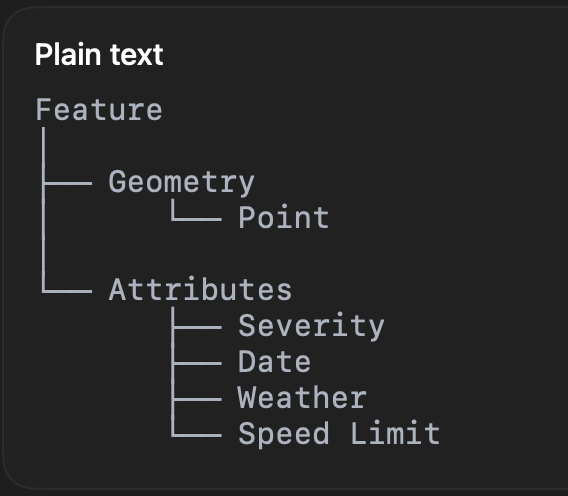

# Welcome to the series of "Today I learned"

## Lesson 1 — Introduction to GIS
Date: August 4, 2026
 
Today I learned what GIS is;
- Analyzing spatial data to identify patterns and support better decisions. Prediction is one possible application of GIS, but not its primary purpose.
- GIS combines different datasets that share a geographic location, helping us understand relationships that would be difficult to see in tables alone.
- Utilities, Supply Chain, City Planning, Emergency Services etc will always make use of this
- The art of decision making can be improved with this type of reasoning
- It allows interdepartmental teams to work together to make more precise decisions
- GIS even allows to cancel the difference in opinions and find a common ground.

The lesson I learned today is that GIS is not just interacting with maps, but something bigger than that. Its "Having a Bird's Eye View" to every industry and situation possible. Helping things to solve in the most precise way possible. This helps to solve problems what languages can have, GIS transforms scattered information into a clear visual perspective, making complex relationships easier to understand.

## Lesson 2 — Coordinates, Latitude & Longitude
Date: August 5, 202

This is so important, if you remember Srikar? Interstellar? your favorite movie, the whole movie takes turn when they figure out coordinates from the Morse code they are receiving somehow in murphy's room. Such a cool movie.

1. What is Latitude?
- They are imaginary horizontal lines. Equator being at 0 degrees and anything above is North while anything below is South

2. What is Longitude?
- They are imaginary Vertical lines with Greenwich meridian being the center zone which is considered for the global time, anything represented Left and Right are considered West to East respectively.

3. Why are they measured differently?
- They are measured separately to identify the exact location of any specific place or city.

4. Why does every location have a unique pair?
- Since Longitude and Latitude have their own geometric representation, places can be identified uniquely. For Eg., Baltimore has 39.3N -76.61W

5. Why do GPS systems use them?
- GPS often helps them to go from point A to point B or to either track a specific moving vehicle to see the progress in real time

6. What happens if you swap Latitude and Longitude?
- It will be entirely in a different location, for instance if you swap those coordinates to -76.6N and 39.3 to W then it will be somewhere in Antarctica.

7. Why are coordinates stored as decimal numbers?
- They are stored in the decimal numbers because they are simplified way to store the geographic location.

## Lesson 3 – Understanding what Spatial Data is
1. What is spatial data? 
- Spatial data is something that tells you about where a specific incident took place. 

2. Why is a crash spreadsheet without coordinates not spatial data?
- because it is the spreadsheet only consists of variables like Severity, Date, and its ID. Where as the spatial data is something which even includes the coordinates like latitude and longitude which gives an entire picture rather than the metrics that helps us to compare, measure and analyze

3. If GeoVision wants to find crashes within 500 meters of a school, why does each crash need geometry?
- That gives us all the possible ways for a crash to take place since we make use of all types of geometry like point, line, polygon to represent the attributes and ultimately predict based on the past events

4. Is “Baltimore City” itself spatial data, or does it depend on how we represent it? Explain.
- No, Baltimore City is just a place, where it requires us to represent attributes like county, roadway, point etc in geometry which makes the the whole city into something we represent with all these geometries.


## Lesson 4 – GeoJSON, Features, Attributes & Layers

1. Imagine one crash.
How would you represent it? Would it be
a. a Point?
b. a Line?
c. a Polygon?

- I would Represent it with a point

2. Besides its location, what information does a crash have?
Examples:
a. Severity
b. Time
c. Road
d. Weather

- Severity
A better answer would be:
Severity,
Date,
Time,
Road Name,
Weather,
Vehicle Type,
Crash ID,
Speed Limit,

3. If Baltimore has
a. crashes
b. hospitals
c. schools
d. bike lanes
Should they all exist in one layer? Or separate layers? Why?

- Separate Layers it is.

4. Why do you think GeoJSON became one of the most popular GIS formats?

- GeoJSON extends JSON by allowing geographic objects (points, lines, polygons) to be stored together with their attributes in a format that web applications can easily understand.

## Lesson 5 – Understanding GeoJSON & FeatureCollections
Date: August 5, 2026

Today I learned one of the most important concepts in web GIS: GeoJSON.

GeoJSON is a standardized format for storing and sharing geographic data. It extends the familiar JSON format by allowing applications to store not only information about an object but also its geographic location.

Unlike normal JSON, GeoJSON can describe where an object exists on Earth, making it the preferred format for modern web mapping applications such as Mapbox and Leaflet.

### The Structure of GeoJSON

Every GeoJSON object follows a logical hierarchy.

```text
FeatureCollection
│
├── Feature
│      ├── Geometry
│      └── Properties
│
├── Feature
│      ├── Geometry
│      └── Properties
│
└── Feature
       ├── Geometry
       └── Properties
```

I realized that GeoJSON organizes spatial information almost like a programming language organizes objects inside a collection.

A **FeatureCollection** is simply a collection of multiple Features.

### What is a Feature?

A Feature represents one real-world object.

Examples include:

- One traffic crash
- One hospital
- One school
- One park
- One road

Everything represented on a GIS map begins as a Feature.

### Geometry

Geometry answers one simple question:

> **Where is the Feature?**

The geometry stores the geographic representation of the object.

Examples:

- Point → Crash, Hospital, School
- LineString → Road, River
- Polygon → Park, Lake, City Boundary

Coordinates (Latitude & Longitude) help define this geometry.

### Properties (Attributes)

Properties describe the Feature.

They answer one question:

> **What is this object?**

For a traffic crash, the properties may include:

- Crash ID
- Severity
- Date
- Time
- Weather
- Road Name
- Speed Limit
- Vehicle Type

The location belongs to the Geometry.

Everything else becomes a Property.

### Feature vs FeatureCollection

One traffic crash is represented as a **Feature**.

Thousands of traffic crashes are grouped together inside a **FeatureCollection**.

This is very similar to how programming languages group objects inside arrays or lists.

### Why GeoJSON became so popular

GeoJSON became popular because it combines the simplicity of JSON with geographic information.

Since modern web applications already understand JSON, GeoJSON makes it easy to exchange spatial data between APIs, databases, and mapping libraries like Mapbox.

### My Biggest Takeaway

Today I realized that maps are not simply collections of markers.

Every marker is actually a **Feature**.

Every Feature has:

- Geometry (Where?)
- Properties (What?)

Multiple Features together become a **FeatureCollection**, which acts as the data source for an entire map layer.

### How GeoVision Maryland Will Use This

GeoVision Maryland will use GeoJSON as the primary format for displaying geographic datasets.

Each dataset—traffic crashes, hospitals, schools, bike lanes, transit stops, and parks—will exist as its own FeatureCollection.

Every object displayed on the map will be represented as a Feature containing Geometry and Properties.

This design allows GeoVision Maryland to efficiently display, filter, analyze, and visualize real-world spatial data.

### Professor's Reflection

This lesson was the point where GIS started feeling less like geography and more like software engineering.

I now understand that every GIS application follows this hierarchy:

**FeatureCollection → Feature → Geometry + Properties**

Once this clicked, GeoJSON stopped looking like random JSON and started looking like a structured representation of the real world.